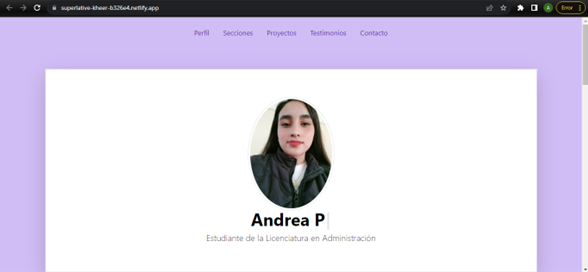

# Portafolio Responsivo con Bootstrap 5

El presente proyecto es creado para el bootcam de **Tecnolochicas PRO Summer Camp**.

Es una página web responsiva *(adapable a diversos tamaños de pantalla)*.

El próposito del sitio web es mostrar el portafolio de proyectos de un(a) desarrollador(a) y su experiencia.

Incluye una descripción de su movitación, experiencia, proyectos, artículos publicados y formas de contacto.

También contiene una sección de almacenamiento de archivos *(imágenes)* que nos permiten modificar la imagen de perfil del desarrollador y contiene una animación desarrollada con JavaScript.

Puedes entrar a ver el proyecto en este vínculo: https://superlative-kheer-b326e4.netlify.app/

## Tecnologías

Está página fue creada con:

* HTML 5
* CSS 3
* Javascript
* Bootstrap 5

Además se incluyen *Google Fonts*

## Español
El texto de la página web está escrito en español, sin embargo las clases relacionadas con Bootstrap se incluyen en inglés.

## Contacto
Desarrollado por: en Tecnolochicas PRO Summer Camp.
[Andrea Perez](https://www.linkedin.com/in/andrea-perez-7a6010282).
